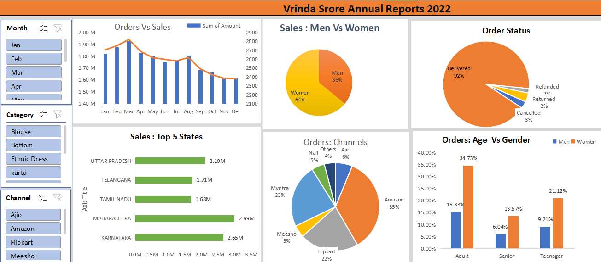

# 📊 Vrinda Store Annual Report 2022 – Excel Project

This project presents the **Annual Sales Report for Vrinda Store (2022)** created entirely using **Microsoft Excel**. It demonstrates how Excel can be used to perform data analysis, create dashboards, and present key business insights in a clear and interactive format.

---

## 🧾 Project Description

The Excel file contains an interactive dashboard with:
- Monthly **Orders vs Sales** analysis
- Gender-wise and age-wise **sales distribution**
- **Order status breakdown**
- Top 5 states by total sales
- Platform/channel-wise order distribution
- Filter options using slicers (Month, Category, Channel)

---

## 📈 Dashboard Snapshot

---

## 🔍 Key Insights

### 📅 Orders vs Sales
- Peak sales in **March**
- Gradual decline in orders and sales from **August to December**

### 👨‍👩‍👧 Gender-wise Sales
- **Women:** 64%
- **Men:** 36%

### 🚚 Order Status
- **Delivered:** 92%
- **Returned & Cancelled:** 3% each
- **Refunded:** 2%

### 🌍 Top 5 States by Sales
- Maharashtra: 2.99M
- Karnataka: 2.65M
- Uttar Pradesh: 2.10M
- Telangana: 1.71M
- Tamil Nadu: 1.68M

### 🛒 Order Channels
- Amazon: 35%
- Myntra: 23%
- Flipkart: 22%
- Meesho: 10%
- Ajio: 6%
- Others: 4%

### 🧑‍🦳 Orders by Age & Gender
- Highest sales from **Adult Women (34.73%)**
- Followed by **Teenage Women (21.12%)**

---

## 🛠️ Tools & Features Used

- **Microsoft Excel**
  - Pivot Tables
  - Pivot Charts
  - Slicers
  - Combo Charts
  - Pie & Bar Charts
  - Data Formatting and Dashboard Layout

---

## 📂 Filters Available

- **Months:** Jan, Feb, Mar, Apr  
- **Categories:** Blouse, Bottom, Ethnic Dress, Kurta  
- **Channels:** Ajio, Amazon, Flipkart, Meesho, Myntra  

---

## 📌 Use Cases

- Business decision-making  
- Sales strategy planning  
- Market segmentation analysis  
- Excel dashboard design for portfolios  

---
